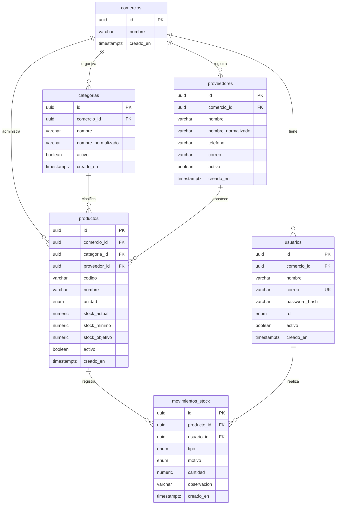

# Modelo de datos

Entrega 2 · Tomás Anchorena y Nazareno Romero · 24/09/2026

## Criterio de diseño

Se utiliza PostgreSQL con un modelo relacional de seis tablas. El esquema acompaña [los requerimientos](01-requerimientos.md) y [las reglas de negocio](02-reglas-de-negocio.md). Mantiene un saldo por producto y un historial de movimientos, actualizados juntos. No hay tablas de alertas ni órdenes: ambas vistas se calculan a partir del inventario.

[schema.prisma](schema.prisma) representa columnas, tipos, relaciones, índices y restricciones únicas. [restricciones.sql](restricciones.sql) complementa los controles de fila que se incorporarán a la primera migración.

## Diagrama entidad-relación

Los nombres del diagrama son los de las tablas y columnas físicas. Las claves únicas compuestas y los detalles de tipos se especifican debajo.

## Convenciones

- Modelos Prisma en PascalCase y propiedades en camelCase. `@map` y `@@map` asignan columnas y tablas en snake_case.
- IDs de tipo UUID generados por Prisma al crear los registros. El UUID no reemplaza permisos.
- Todas las columnas son obligatorias y `NOT NULL`, excepto teléfono/correo del proveedor y observación del movimiento. Una cadena vacía opcional se convierte a `NULL` en el backend.
- Fechas `TIMESTAMPTZ(3)`, asignadas por el sistema al crear el registro (`@default(now())`) y mostradas en hora local de Argentina. El usuario no elige la fecha de un movimiento.
- Cantidades `NUMERIC(12,3)`, representadas por `Decimal` en Prisma. Los campos monetarios no forman parte del esquema.
- En cadenas se valida longitud y contenido luego de normalizar. El cliente no puede editar IDs, responsables, campos normalizados ni fechas.

## Diccionario de datos

### comercios / Comercio

| Campo | Tipo PostgreSQL | Restricciones y valor inicial | Descripción |
|---|---|---|---|
| id | UUID | PK; generado por Prisma | Identificador del comercio. |
| nombre | VARCHAR(120) | Obligatorio; no vacío | Nombre de presentación. No es único globalmente. |
| creado_en | TIMESTAMPTZ(3) | Obligatorio; `now()` | Fecha de creación. |

No tiene `activo` porque el MVP no administra la baja de comercios. Se crean desde el seed.

### usuarios / Usuario

| Campo | Tipo PostgreSQL | Restricciones y valor inicial | Descripción |
|---|---|---|---|
| id | UUID | PK; generado por Prisma | Identificador de la cuenta. |
| comercio_id | UUID | FK a comercios.id | Comercio autorizado para esa cuenta. |
| nombre | VARCHAR(120) | Obligatorio; no vacío | Nombre del responsable mostrado en el historial. |
| correo | VARCHAR(254) | UNIQUE global; normalizado | Identificador de acceso; formato de correo validado por el backend/seed. |
| password_hash | VARCHAR(255) | Obligatorio | Hash de contraseña; no se devuelve en la API. |
| rol | rol_usuario | `DUENO` o `EMPLEADO` | Permisos funcionales; el seed lo asigna explícitamente. |
| activo | BOOLEAN | `true` | Permite bloquear próximas solicitudes sin borrar el historial. |
| creado_en | TIMESTAMPTZ(3) | `now()` | Fecha de creación. |

Cada cuenta pertenece a un solo comercio. No se implementa selector de comercios ni traslado de cuentas. La eventual administración técnica de una cuenta debe conservar esta asociación.

### categorias / Categoria

| Campo | Tipo PostgreSQL | Restricciones y valor inicial | Descripción |
|---|---|---|---|
| id | UUID | PK; generado por Prisma | Identificador de la categoría. |
| comercio_id | UUID | FK a comercios.id | Comercio propietario. |
| nombre | VARCHAR(120) | Obligatorio; no vacío | Nombre visible con espacios normalizados, conservando mayúsculas y tildes. |
| nombre_normalizado | VARCHAR(120) | UNIQUE con comercio_id | Nombre visible convertido a minúsculas; generado en el backend. |
| activo | BOOLEAN | `true` | Habilita su selección en productos. |
| creado_en | TIMESTAMPTZ(3) | `now()` | Fecha de creación. |

### proveedores / Proveedor

| Campo | Tipo PostgreSQL | Restricciones y valor inicial | Descripción |
|---|---|---|---|
| id | UUID | PK; generado por Prisma | Identificador del proveedor. |
| comercio_id | UUID | FK a comercios.id | Comercio propietario. |
| nombre | VARCHAR(120) | Obligatorio; no vacío | Nombre de presentación. |
| nombre_normalizado | VARCHAR(120) | UNIQUE con comercio_id | Identificador de nombre para impedir duplicados dentro del comercio. |
| telefono | VARCHAR(40) | Opcional | Dato de contacto textual; admite prefijos y signos. |
| correo | VARCHAR(254) | Opcional; no único | Contacto, distinto del identificador de acceso de usuarios. |
| activo | BOOLEAN | `true` | Habilita la asignación a productos activos. |
| creado_en | TIMESTAMPTZ(3) | `now()` | Fecha de creación. |

No se almacenan cuentas corrientes ni datos fiscales. El proveedor no inicia sesión. Para el alcance piloto, el equipo elige nombres distinguibles: dos proveedores no pueden tener el mismo nombre normalizado dentro del comercio.

### productos / Producto

| Campo | Tipo PostgreSQL | Restricciones y valor inicial | Descripción |
|---|---|---|---|
| id | UUID | PK; generado por Prisma | Identificador interno estable. |
| comercio_id | UUID | FK a comercios.id | Comercio propietario. |
| categoria_id | UUID | FK a categorias.id | Categoría obligatoria, del mismo comercio. |
| proveedor_id | UUID | FK a proveedores.id | Proveedor principal obligatorio, del mismo comercio. |
| codigo | VARCHAR(50) | UNIQUE con comercio_id | Código en mayúsculas y sin espacios, según RN-02. |
| nombre | VARCHAR(160) | Obligatorio; no vacío | Nombre descriptivo; no necesita ser único. |
| unidad | unidad_medida | `UNIDAD` o `KG` | Unidad única para saldo, umbrales y movimientos. |
| stock_actual | NUMERIC(12,3) | Inicial 0; CHECK >= 0 | Saldo mantenido exclusivamente mediante movimientos de aplicación. |
| stock_minimo | NUMERIC(12,3) | Inicial 0; CHECK >= 0 | Umbral de alerta; cero desactiva alertas. |
| stock_objetivo | NUMERIC(12,3) | Inicial 0; CHECK >= stock_minimo | Nivel hasta el cual se sugiere reponer. |
| activo | BOOLEAN | `true` | Baja lógica sin alterar saldo o historial. |
| creado_en | TIMESTAMPTZ(3) | `now()` | Fecha de alta. |

Para `UNIDAD`, un CHECK adicional exige que stock actual, mínimo y objetivo sean enteros. Si el alta recibe un mínimo positivo sin un objetivo válido, se rechaza; el valor por defecto no autoriza una configuración contradictoria. El saldo puede superar el objetivo.

### movimientos_stock / MovimientoStock

| Campo | Tipo PostgreSQL | Restricciones y valor inicial | Descripción |
|---|---|---|---|
| id | UUID | PK; generado por Prisma | Identificador del movimiento. |
| producto_id | UUID | FK a productos.id | Producto afectado; determina también el comercio y la unidad. |
| usuario_id | UUID | FK a usuarios.id | Responsable autenticado; debe ser del mismo comercio que el producto. |
| tipo | tipo_movimiento | `INGRESO` o `EGRESO` | Determina si la cantidad suma o resta. |
| motivo | motivo_movimiento | Cuatro valores enumerados | STOCK_INICIAL, REPOSICION, SALIDA o AJUSTE. |
| cantidad | NUMERIC(12,3) | CHECK > 0 | Magnitud positiva. El backend comprueba enteros para UNIDAD. |
| observacion | VARCHAR(500) | Opcional, salvo AJUSTE | Explicación; en AJUSTE debe contener texto no vacío. |
| creado_en | TIMESTAMPTZ(3) | `now()` | Fecha de registro. |

No se duplica `comercio_id` ni la unidad. El historial obtiene esos datos por el producto. Las FK comprueban existencia, pero no que producto y responsable pertenezcan al mismo comercio: esa comprobación es del backend y del seed.

## Relaciones, claves e índices

Todas las relaciones son uno a muchos: un registro padre admite cero o muchos hijos y cada hijo tiene exactamente el padre indicado. Las FK usan `ON DELETE RESTRICT` y `ON UPDATE RESTRICT`. No se ofrecen eliminaciones físicas desde la aplicación ni modificaciones de IDs. Un producto con movimientos no puede eliminarse sin infringir la FK.

| Tabla | Restricción o índice | Motivo |
|---|---|---|
| Todas | PK(id) | Identificación y búsqueda directa. |
| usuarios | UNIQUE(correo) | Identificador global de acceso. |
| usuarios | INDEX(comercio_id) | Consulta de cuentas de un comercio. |
| categorias | UNIQUE(comercio_id, nombre_normalizado) | Nombres únicos por comercio, también ante altas simultáneas. |
| proveedores | UNIQUE(comercio_id, nombre_normalizado) | Mismo criterio de unicidad. |
| productos | UNIQUE(comercio_id, codigo) | Código único dentro del comercio. |
| productos | INDEX(comercio_id, activo) | Catálogo activo y consulta inicial de alertas. |
| productos | INDEX(categoria_id), INDEX(proveedor_id) | Relaciones y comprobación de productos asociados. |
| movimientos_stock | INDEX(producto_id, creado_en) | Historial por producto y fecha. |
| movimientos_stock | INDEX(usuario_id) | Referencia al responsable. |

Los índices únicos de categorías, proveedores y productos ya comienzan por comercio_id; no se agregan índices idénticos sobre ese prefijo sin necesidad. El filtro de alerta compara dos columnas (`stock_actual < stock_minimo`): se evalúa sobre los productos del comercio, sin un índice especializado para el volumen piloto.

## Dónde se garantiza cada regla

| Control | PostgreSQL / schema.prisma | SQL complementario | Backend y seed |
|---|---|---|---|
| Existencia de referencias | FK simples | — | Verificar además comercio y actividad. |
| Código, correo y nombres únicos | UNIQUE | — | Normalizar y manejar el error de unicidad. |
| Actividad y permisos | Campos booleanos/enums, sin autorización automática | — | Comprobar usuario, rol, comercio y estado en cada operación. |
| Stock no negativo y objetivo >= mínimo | Tipos decimales | CHECK de productos | Validar entradas y usar operación condicional. |
| Valores enteros para producto UNIDAD | Enum y decimales | CHECK sobre los tres campos de stock de productos | Validar antes de escribir y rechazar redondeos. |
| Movimiento positivo | Decimal | CHECK cantidad > 0 | Validar precisión, rango y unidad del producto. |
| Movimiento entero según unidad | — | No se agrega CHECK entre tablas | Validar contra el producto dentro de la operación. |
| Tipo/motivo compatible y ajuste con texto | Enums y campo opcional | CHECK en movimientos_stock | Validar también quién puede usar cada motivo y no aceptar observaciones de solo espacios. |
| Stock inicial solo en alta; historial inmutable | — | — | No ofrecer operaciones que eludan los flujos definidos. |
| Saldo igual a suma de movimientos | — | No lo garantiza un CHECK de fila | Mantener ambas escrituras en la misma transacción. |

Los controles de `restricciones.sql` deben agregarse al SQL de la primera migración después de crear las tablas. Prisma 7 no expresa estos CHECK en el archivo de esquema utilizado. Las validaciones que dependen de otras filas, como unidad del producto o rol del responsable, no se implementan como CHECK ni con triggers.

Se eligen FK simples y validación por comercio en el backend para este alcance. Esto no equivale a aislamiento automático por la base: no se implementa RLS ni claves foráneas compuestas de comercio. Una escritura SQL directa puede eludir reglas de aplicación; los scripts administrativos deben respetar las mismas asociaciones y normalizaciones. La base no se expone directamente al navegador.

## Operaciones transaccionales

### Registrar movimientos

1. Validar la identidad, rol, motivo y formato de cantidades.
2. Abrir una transacción y obtener el producto del comercio con bloqueo de fila (`SELECT ... FOR UPDATE`, parametrizado). Comprobar unidad y actividad. El bloqueo también coordina movimientos con cambios de unidad y bajas; no habilita cálculos de saldo fuera de la transacción.
3. Para un egreso, ejecutar el decremento condicionado por ID, comercio, actividad y saldo suficiente. Para un ingreso, incrementar condicionado por ID, comercio y actividad. Verificar que se modificó exactamente un registro.
4. Insertar el movimiento con el usuario autenticado usando el mismo cliente transaccional. Si cualquier paso falla, revertir todo.
5. Confirmar y devolver el saldo resultante. El backend no reintenta a ciegas una solicitud cuyo resultado sea incierto; la interfaz permite consultar el historial antes de repetirla.

El decremento condicional es la protección frente al sobregiro. El bloqueo de producto permite que la validación de unidad siga siendo válida hasta confirmar la operación. Cambiar unidad, editar/bajar/reactivar productos y registrar sus movimientos deben coordinarse sobre esa misma fila. No se pueden cambiar unidades si existe historial, aunque el saldo sea cero.

### Catálogo y referencias activas

Para evitar que una categoría/proveedor se desactive mientras se asigna a un producto, las operaciones de creación/edición/reactivación y desactivación de referencias se realizan con bloqueo de las filas involucradas dentro de una transacción. Se bloquea primero el producto cuando ya existe, luego las categorías y después los proveedores involucrados, con IDs ordenados dentro de cada tabla; tras bloquear se vuelven a comprobar los estados y asociaciones.

La baja de una categoría o proveedor bloquea esa referencia y consulta si tiene productos activos, sin bloquear después esos productos. Un alta o reactivación que compite por la misma referencia espera y comprueba su estado actualizado. Así no queda un producto activo con una referencia inactiva por haber hecho dos comprobaciones separadas. Si hay conflicto o cancelación de transacción, se informa el fallo sin cambios parciales.

Prisma no ofrece `FOR UPDATE` en sus métodos habituales, por lo que los bloqueos se harán con `$queryRaw` parametrizado dentro de la transacción interactiva, sin concatenar datos del usuario en el SQL.

## Alertas, reposición e historial

Las alertas se calculan consultando productos activos del comercio cuyo stock actual sea menor al mínimo. Para reposición se agrega el proveedor y se calcula objetivo menos actual. No se guardan alertas que puedan quedar desactualizadas ni pedidos con estados que no forman parte del MVP.

La lista copiable incluye fecha del cálculo y es temporal. No reserva mercadería ni registra compras. El dueño registra una reposición cuando se recibe el producto, con independencia de lo copiado anteriormente.

El stock inicial es un movimiento, por lo que la suma de ingresos menos egresos debe coincidir con el saldo. Las bajas lógicas no modifican esa suma. Los nombres visibles del producto/usuario se consultan desde sus registros actuales; el MVP conserva los hechos y responsables, pero no un historial de cambios de nombres.

## Uso previsto de Prisma 7

El esquema define `provider = "prisma-client"` con `output` explícito. El datasource contiene solo `provider = "postgresql"`; la URL se configurará mediante `DATABASE_URL` en `backend/prisma.config.ts`. La ruta de salida está pensada para cuando el esquema se ubique en `backend/prisma/schema.prisma`; no se debe generar el cliente desde esta copia documental.

Al implementar se fijarán versiones compatibles de Prisma, del cliente y del adaptador de PostgreSQL, y las migraciones se guardarán en el repositorio.

Para la API, las cantidades se serializarán como cadenas decimales, por ejemplo `"0.250"`. La interfaz podrá mostrar `0,250 kg`; el backend realizará cálculos con Decimal, sin convertir las cantidades a `Number` para modificar el stock.
