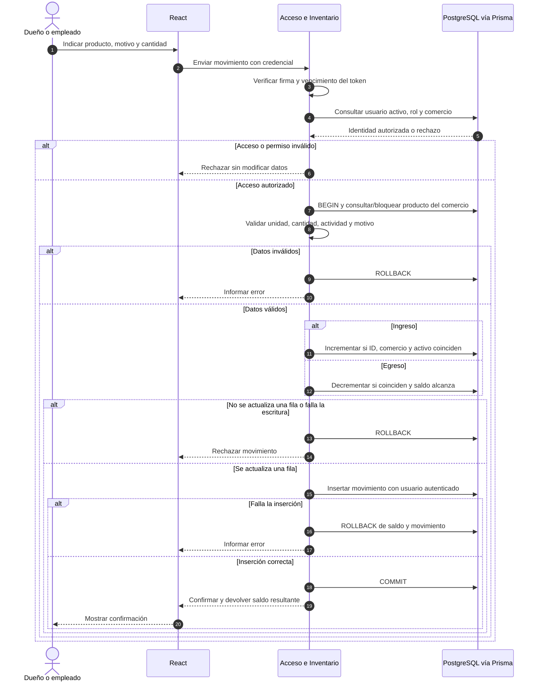

# Módulos y estructura del repositorio

Entrega 2 · Tomás Anchorena y Nazareno Romero · 24/09/2026

## Arquitectura prevista

**React → API REST con Node.js y Express → Prisma → PostgreSQL.**

Se desarrollará una aplicación web con un backend único y una base relacional. El frontend muestra información y valida formularios para facilitar la carga; el backend decide permisos y aplica las reglas de negocio. Prisma realiza el acceso a datos y PostgreSQL conserva las relaciones, restricciones y transacciones.

Los módulos son divisiones de responsabilidad dentro de la misma aplicación, no servicios desplegados por separado. No se incorporan microservicios ni infraestructura de orquestación.

## Módulos del backend

| Módulo | Responsabilidad | Requerimientos | Datos |
|---|---|---|---|
| Acceso y permisos | Login, validación del token, consulta de usuario activo, contexto de comercio y autorización por rol. No incluye registro público ni ABM de cuentas. | RF-01, RF-02 | Usuario, Comercio |
| Catálogo | Administración de categorías, proveedores y productos; normalización de nombres/códigos; bajas y reactivaciones; validación de referencias. | RF-03 a RF-06 | Categoria, Proveedor, Producto |
| Inventario | Registro de reposiciones, salidas y ajustes; operación atómica sobre saldo y movimiento; historial por producto. | RF-07 a RF-09; colabora con RF-04 | Producto, MovimientoStock, Usuario |
| Alertas y reposición | Consulta de productos activos bajo mínimo y construcción de listas agrupadas por proveedor. No crea pedidos ni movimientos. | RF-10 a RF-12 | Lectura de Producto y Proveedor |

### Dependencias y organización interna

- Acceso y permisos se ejecuta antes de cada operación protegida. El resto recibe el usuario, rol y comercio ya verificados.
- Catálogo valida referencias del mismo comercio. Al crear un producto con stock inicial, abre una transacción y llama a la lógica de Inventario con ese mismo cliente transaccional. No realiza una segunda llamada HTTP ni una transacción independiente.
- Inventario verifica el producto y aplica `increment`/`decrement` condicionado. Nunca acepta desde el cliente un saldo final o un usuario responsable arbitrario.
- Alertas y reposición consulta el saldo almacenado y los umbrales. El frontend mantiene las ediciones temporales de la lista y produce el texto copiable; volver a consultar descarta esas ediciones.
- Cada módulo tendrá rutas/controladores para HTTP, validaciones de entrada y servicios para las reglas y operaciones con Prisma. Un cliente compartido de Prisma permite trabajar con transacciones. No se agrega una capa genérica de repositorios sin una necesidad concreta.

Las operaciones que combinan actividad de referencias y asignación de productos necesitan coordinación transaccional, detallada en [el modelo](03-modelo-de-datos.md#operaciones-transaccionales). No se realizan esas verificaciones únicamente en el frontend.

## Módulos del frontend

| Módulo | Pantallas o componentes previstos | Comportamiento |
|---|---|---|
| Acceso | Login y navegación según rol | Iniciar/cerrar sesión, informar credenciales inválidas y volver al acceso cuando una solicitud sea rechazada por sesión inválida. |
| Catálogo | Listado/búsqueda de productos, detalle, formularios del dueño, categorías y proveedores | Mostrar existencias y umbrales; incluir consulta de inactivos y acciones de reactivación autorizadas. |
| Inventario | Formulario de ingreso/egreso, ajuste del dueño e historial por producto | Mostrar unidad, validar cantidad, evitar envíos repetidos mientras una solicitud está pendiente y mostrar confirmación solo después de la respuesta exitosa. |
| Alertas y reposición | Panel de faltantes para ambos roles; lista por proveedor para el dueño | Mostrar mínimos, objetivos y sugerencias; editar u omitir ítems temporalmente y copiar texto. Informar cuándo se calculó y que recalcular descarta los cambios. |

Ocultar un botón no constituye un control de seguridad: el backend comprueba los permisos ante cualquier solicitud. Los importes de stock viajan como cadenas decimales en la API; la interfaz aplica formato local, sin usar números binarios de coma flotante para determinar saldos o cantidades sugeridas.

## Estructura actual de la entrega

```text
stock-manager/
├── README.md
└── docs/
    ├── TFI_Entrega1_Anchorena_Romero.pdf
    └── segunda_entrega/
        ├── 01-requerimientos.md
        ├── 02-reglas-de-negocio.md
        ├── 03-modelo-de-datos.md
        ├── schema.prisma
        ├── restricciones.sql
        └── 04-modulos.md
```

## Estructura prevista al implementar

```text
stock-manager/
├── README.md
├── docs/                        # Informes y diseño de las entregas
├── backend/
│   ├── package.json
│   ├── prisma.config.ts          # Rutas y conexión mediante DATABASE_URL
│   ├── .env.example              # Nombres de variables, sin secretos
│   ├── prisma/
│   │   ├── schema.prisma
│   │   ├── migrations/           # Incluye los CHECK del diseño
│   │   └── seed.js               # Comercios y usuarios piloto
│   ├── src/
│   │   ├── app.js                # Configuración de Express
│   │   ├── server.js             # Arranque del servidor
│   │   ├── generated/prisma/     # Cliente generado; no código manual
│   │   ├── lib/                  # Acceso compartido a Prisma
│   │   ├── middlewares/          # Autenticación, permisos y errores
│   │   └── modules/
│   │       ├── acceso/
│   │       ├── catalogo/
│   │       ├── inventario/
│   │       └── reposicion/
│   └── tests/
└── frontend/
    ├── package.json
    └── src/
        ├── app/
        ├── components/          # Elementos compartidos
        ├── services/            # Comunicación HTTP
        └── features/
            ├── acceso/
            ├── catalogo/
            ├── inventario/
            └── reposicion/
```

Es la estructura de referencia para la implementación. El backend se desarrollará en JavaScript con módulos ES (import/export). Como el generador prisma-client de Prisma 7 produce TypeScript, se utilizará tsx para ejecutar el servidor y el cliente generado, sin una compilación previa separada. Los scripts previstos son `npm run dev` (tsx watch, con recarga automática) y `npm start`. tsx se instalará como dependencia de ejecución porque también se usa en el despliegue. En Prisma 7 el cliente se crea con un adaptador de PostgreSQL (@prisma/adapter-pg), y el cliente se regenera con `prisma generate` cada vez que cambia el esquema.

## Secuencia de registrar un movimiento

Este diagrama representa CU-05 y CU-06. El alta inicial usa la misma operación dentro de la transacción de creación del producto. Las comprobaciones sin cambios se completan antes de confirmar el movimiento; si fallan, el flujo termina con error.



No se incluye un diagrama de estados de órdenes porque el MVP no guarda órdenes ni tiene ese ciclo de vida.

## Verificaciones previstas durante la implementación

| Caso | Resultado esperado |
|---|---|
| Dos egresos concurrentes de 3 con saldo inicial 3 | Uno se confirma; el otro se rechaza. Saldo 0 y un solo movimiento nuevo. |
| Ingreso o ajuste positivo sobre un producto inactivo | Ningún cambio de saldo ni movimiento. |
| Falla la inserción después de actualizar el saldo | La transacción restaura el saldo anterior. |
| Falla el ingreso inicial | Tampoco queda creado el producto. |
| Crear dos categorías equivalentes simultáneamente | La restricción única admite solo una. |
| Desactivar referencia mientras se reactiva/asigna un producto | No queda un producto activo asociado a una referencia inactiva. |
| Cambiar unidad mientras se registra el primer movimiento | La coordinación sobre el producto impide un historial incompatible. |
| Token vigente de usuario desactivado | La siguiente solicitud protegida se rechaza. |
| ID de otro comercio o usuario responsable manipulado | La operación se rechaza sin revelar datos ajenos. |
| Stock igual al mínimo, mínimo cero y lista vacía | Se respeta RN-12 y se muestran estados vacíos útiles. |
| Movimiento fraccionario sobre UNIDAD | El backend lo rechaza antes de escribir. |
